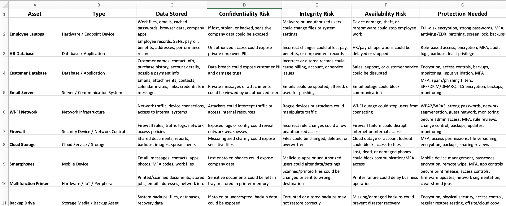

# L01 - Asset Inventory + CIA Risk Assessment

## Objective

The objective of this lab was to create a basic asset inventory, identify the type of data stored on each asset, assess risks using the CIA Triad, and recommend appropriate protections.

This lab helped me practice foundational cybersecurity thinking by connecting everyday technology assets to confidentiality, integrity, and availability risks.

---

## Scenario

A small organization or home office environment needs to understand what technology assets exist and what risks are connected to each asset.

As part of this review, I identified common assets, documented the type of data each one may store or process, assessed CIA-related risks, and recommended basic security protections.

---

## Tools Used

- Microsoft Excel
- GitHub
- Markdown
- CIA Triad Framework

---

## Assets Reviewed

The following assets were included in this assessment:

- Employee laptops
- HR database
- Customer database
- Email server
- Wi-Fi network
- Firewall
- Cloud storage
- Smartphones
- Multifunction printer
- Backup drive

---

## Completed Asset Inventory Table

| Asset | Type | Data Stored | Confidentiality Risk | Integrity Risk | Availability Risk | Protection Needed |
|---|---|---|---|---|---|---|
| Employee Laptops | Hardware / Endpoint Device | Work files, emails, cached passwords, browser data, company apps | If lost, stolen, or hacked, sensitive company data could be exposed | Malware or unauthorized users could change files or system settings | Device damage, theft, or ransomware could stop employee work | Full-disk encryption, strong passwords, MFA, antivirus/EDR, patching, screen lock, backups |
| HR Database | Database / Application | Employee records, SSNs, payroll, benefits, addresses, performance records | Unauthorized access could expose private employee PII | Incorrect changes could affect pay, benefits, or employment records | HR/payroll operations could be delayed or stopped | Role-based access, encryption, MFA, audit logs, backups, least privilege |
| Customer Database | Database / Application | Customer names, contact info, purchase history, account details, possible payment info | Data breach could expose customer PII and damage trust | Incorrect or altered records could cause billing, account, or service issues | Sales, support, or customer service could be disrupted | Encryption, access controls, backups, monitoring, input validation, MFA |
| Email Server | Server / Communication System | Emails, attachments, contacts, calendar invites, links, credentials in messages | Private messages or attachments could be viewed by unauthorized users | Emails could be spoofed, altered, or used for phishing | Email outage could block communication | MFA, spam/phishing filters, SPF/DKIM/DMARC, TLS encryption, backups, monitoring |
| Wi-Fi Network | Network Infrastructure | Network traffic, device connections, access to internal systems | Attackers could intercept traffic or access internal resources | Rogue devices or attackers could manipulate traffic | Wi-Fi outage could stop users from connecting | WPA2/WPA3, strong passwords, network segmentation, guest network, monitoring |
| Firewall | Security Device / Network Control | Firewall rules, traffic logs, network access policies | Exposed logs or config could reveal network weaknesses | Incorrect rule changes could allow unauthorized access | Firewall failure could disrupt internet or internal access | Secure admin access, MFA, rule reviews, change control, backups, updates, monitoring |
| Cloud Storage | Cloud Service / Storage | Shared documents, reports, backups, images, spreadsheets | Misconfigured sharing could expose sensitive files | Files could be changed, deleted, or overwritten | Cloud outage or account lockout could block access to files | MFA, access permissions, file versioning, encryption, backups, sharing reviews |
| Smartphones | Mobile Device | Email, messages, contacts, apps, photos, MFA codes, work files | Lost or stolen phones could expose company data | Malicious apps or unauthorized users could alter data/settings | Lost, dead, or damaged phones could block communication/MFA access | Mobile device management, passcodes, encryption, remote wipe, MFA, app controls |
| Multifunction Printer | Hardware / IoT / Peripheral | Printed/scanned documents, stored jobs, email addresses, network info | Sensitive documents could be left in tray or stored in printer memory | Scanned/printed files could be changed or sent to wrong destination | Printer failure could delay business operations | Secure print release, access controls, firmware updates, network segmentation, clear stored jobs |
| Backup Drive | Storage Media / Backup Asset | System backups, files, databases, recovery data | If stolen or unencrypted, backup data could be exposed | Corrupted or altered backups may not restore correctly | Missing/damaged backups could prevent disaster recovery | Encryption, physical security, access control, regular restore testing, offsite/cloud copy |

---

## Key Findings

Several assets in the inventory store or provide access to sensitive data, including employee records, customer information, email communications, and system backups.

The highest-risk assets were the HR database, customer database, cloud storage, and backup drive because they may contain personally identifiable information or critical recovery data.

This lab also showed that everyday assets such as laptops, smartphones, printers, and Wi-Fi networks can create serious security risks if they are not properly protected.

---

## Risk or Gap Identified

A major gap identified in this lab is that many assets require layered protection. One control alone is not enough.

For example, a laptop should not only have a password. It should also have encryption, patching, endpoint protection, MFA, and backup protection.

Another gap is that backup drives can create serious confidentiality risks if they are not encrypted or physically secured.

---

## Recommendations

Based on the assessment, the organization should prioritize:

1. Enforcing MFA on email, cloud storage, and administrative accounts
2. Encrypting laptops, smartphones, databases, and backup drives
3. Applying role-based access control to HR and customer systems
4. Reviewing firewall rules and cloud sharing permissions regularly
5. Testing backups to confirm data can be restored after an incident
6. Segmenting guest Wi-Fi from internal business systems
7. Keeping all devices patched and monitored

---

## Screenshots / Evidence

Asset inventory table:

---

## Reflection

This lab helped me understand how cybersecurity begins with knowing what assets exist, what data they hold, and what could go wrong if those assets are exposed, changed, or unavailable.

The biggest takeaway is that risk is not limited to obvious systems like databases or firewalls. Everyday assets such as laptops, smartphones, printers, and backup drives can create serious security issues if they are not included in the organization’s asset inventory and risk assessment process.
